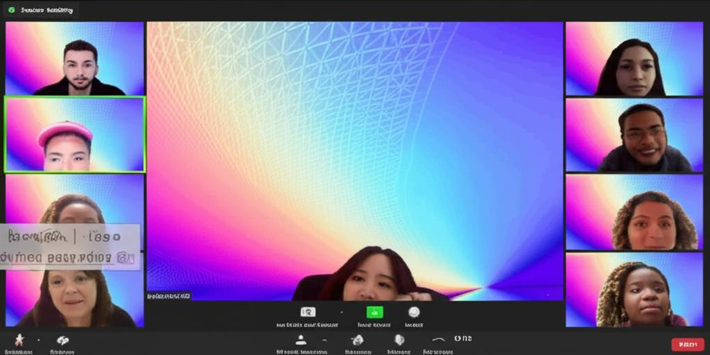

# New Zoom Background Script



## Purpose

This script automates the process of changing your Zoom virtual background to a random video from a designated directory. It is designed to be simple and easy to use, allowing you to keep your Zoom background fresh and interesting.

## Installation

1.  Place the script `new_zoom_background.py` in a directory of your choosing.
2.  Ensure you have OBS Studio installed and configured with the virtual camera plugin.
3.  You will need to adjust the paths at the top of the script `new_zoom_background.py` to reflect your setup:
    *   `zoom_backgrounds_dir`:  The directory where your Zoom background video files are stored.  These files must end with `.mp4` or `.mov`
    *   `scenes_file`: The path to your OBS scenes configuration file (usually `Untitled.json`).
    *   `applescript_file`: The path to your AppleScript file that starts OBS with the virtual camera (e.g., `obs_virtual_camera.applescript`).
    *   `current_background_file`: The path to the file where the name of the current background file is saved (e.g., `current_background.txt`).

4.  Create an AppleScript file with the following content to start OBS with the virtual camera, and save it to the location indicated by `applescript_file`.  The name of the application might need to be updated for your system.

```applescript
tell application "OBS"
	activate
	delay 1
																				
	start virtualcam
end tell
```

5.  Make sure the script has execute permissions: `chmod +x new_zoom_background.py`.

## How to Use

1.  Place your Zoom background video files (in `.mp4` or `.mov` format) into the directory specified by `zoom_backgrounds_dir`.
2.  Run the script from the command line: `./new_zoom_background.py`
3.  The script will:
    *   Terminate any existing OBS instances.
    *   Select a random video from your backgrounds directory.
    *   Update the OBS scene configuration to use the selected video as your virtual background.
    *   Save the name of the background video to `current_background.txt`
    *   Start OBS with the virtual camera enabled.

4.  In Zoom, select OBS Virtual Camera as your camera source.

## Examples

**Running the script:**

```bash
./new_zoom_background.py
```

This will automatically update your OBS configuration and start the virtual camera with a new, randomly selected background video.

## License

This project is licensed under [CC BY-NC 4.0](https://darren-static.waft.dev) - free to use and modify, but no commercial use without permission.
